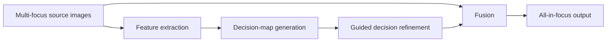

# GACN

PyTorch implementation of **“End-to-End Learning for Simultaneously Generating Decision Map and Multi-Focus Image Fusion Result”**, published in *Neurocomputing*.

> [!IMPORTANT]
> **Repository provenance:** this codebase originates from the authors' [Keep-Passion/GACN](https://github.com/Keep-Passion/GACN) project. The model, paper, figures, and original implementation should be credited to B. Ma, X. Yin, D. Wu, and the paper's co-authors. This repository is a separate copy and does not document an original implementation by the current GitHub account.

## Overview

Multi-focus image fusion combines the in-focus regions of source images into a single all-in-focus result. GACN uses a cascaded network to produce both a decision map and a fused image in an end-to-end workflow.

The accompanying paper introduces:

- simultaneous decision-map and fusion-result generation
- a gradient-aware loss for preserving image gradients
- guided filtering within the decision path
- decision calibration for multi-image fusion
- evaluation against 19 comparison methods using six assessment metrics


## Method outline



For multi-image fusion, the implementation supports a decision-calibration strategy and a sequential origin strategy.

## Repository structure

```text
.
├── main.py                 # Pair and multi-image fusion examples
├── train_net.py            # Training and validation script
├── export.py               # ONNX export entry point
├── compare.py              # Hard-coded PSNR and SSIM comparison helper
├── nets/
│   ├── gacn_net.py         # GACN model and fusion interface
│   ├── coco_dataset.py     # Training dataset and augmentation
│   ├── ga_loss.py          # Gradient-aware loss
│   ├── guided_filter.py    # Guided-filter implementation
│   ├── nets_utility.py     # Training and image utilities
│   └── parameters/
│       └── GACN.pkl        # Expected pretrained checkpoint
├── paper/                  # Architecture and comparison figures
├── requirements.txt
└── LICENSE                 # GNU LGPL 2.1
```

## Original environment

The checked-in requirements describe a legacy research environment:

- Python 3.6
- PyTorch 1.2.0
- torchvision 0.4.0
- NumPy 1.17.0
- scikit-image 0.15.0
- OpenCV Python 4.5.1.48
- Pillow 8.1.1
- Matplotlib 3.1.1

These versions are old and may not provide wheels for current Python, CUDA, or operating-system releases. Reproduce the original environment in an isolated environment rather than installing it into a modern shared environment.

## Installation

Clone this copy:

```bash
git clone https://github.com/xioubin/GACN.git
cd GACN
```

Create a compatible environment. Conda is recommended for legacy Python and CUDA combinations:

```bash
conda create -n gacn python=3.6
conda activate gacn
pip install -r requirements.txt
```

A working installation may require an archived package channel or a PyTorch/CUDA combination selected from historical PyTorch releases.

Do not casually upgrade individual numerical or vision packages: APIs used by this snapshot, including NumPy and scikit-image behavior, have changed in newer releases.

## Pretrained checkpoint

Inference constructs `GACN_Fuse` and loads:

```text
nets/parameters/GACN.pkl
```

The implementation is configured for CUDA and maps a historical `cuda:3` checkpoint location to `cuda:0`. Confirm that the checkpoint is present and review device handling before running on a different GPU or CPU-only host.

Treat model checkpoints as externally sourced artifacts. Verify their origin, license, integrity, and compatibility before use.

## Inference data layout

### Pairwise fusion

`main.py` expects image pairs under `data/multi_focus/` using matching names:

```text
data/multi_focus/
├── example_1.png
├── example_2.png
├── scene_1.png
└── scene_2.png
```

Outputs are configured under:

```text
data/result/
```

### Multi-image fusion

The multi-image path expects one directory per scene:

```text
data/material/
├── scene_a/
│   ├── focus_01.png
│   ├── focus_02.png
│   └── focus_03.png
└── scene_b/
    ├── focus_01.png
    └── focus_02.png
```

All source images in a group should be spatially aligned and have compatible dimensions and channels.

## Usage

### Inference

```bash
python main.py
```

The script invokes both pairwise fusion and calibrated multi-image fusion with paths defined in source code.

> [!WARNING]
> The current `image_fusion` loop contains snapshot-specific control flow: it only calls `fuse` for `color_lytro_06` and then executes an unconditional `continue`, so the pairwise output-saving code is unreachable. Review and repair this path before treating `python main.py` as a general pairwise inference command.

### Training

```bash
python train_net.py
```

Training is configured in source code for:

- device `cuda:0`
- 50 epochs
- batch size 16
- learning rate `1e-4`
- training images under `data/mydata/train`
- validation images under `data/mydata/val`
- masks under `data/mydata/mask_train` and `mask_val`
- checkpoints under `nets/parameters/`
- logs under `nets/train_record/`

The script assumes CUDA and does not expose these settings through command-line arguments.

### ONNX export

```bash
python export.py
```

The export path creates `GACN_520x520.onnx` through the model wrapper. Validate exported inputs, outputs, opset compatibility, and numerical parity before deployment.

### Image comparison helper

`compare.py` computes PSNR and SSIM for two paths hard-coded in the script. Update those paths before use. Its scikit-image call follows the legacy API pinned by this repository.

## Visual results

Decision-map comparison:


Decoder comparison:


These figures originate from the upstream research project and should be attributed to the paper authors.

## Reproducibility notes

- The implementation is tied to a legacy PyTorch/CUDA stack.
- Inference and training paths are configured directly in Python files.
- Training datasets and their redistribution terms are not fully packaged in this repository.
- GPU selection is hard-coded.
- No command-line configuration, environment lock beyond pinned pip packages, or portable CPU path is provided.
- The GitHub Actions workflow targets newer Python versions than the pinned Python 3.6-era dependencies and runs `pytest`, but no test suite was identified during this review.
- Numerical results in the paper should not be claimed as reproduced unless the exact data, weights, environment, preprocessing, and evaluation scripts have been verified.

## Citation

If you use this implementation or its results, cite the original paper:

```bibtex
@article{ma2022gacn,
  title   = {End-to-end learning for simultaneously generating decision map and multi-focus image fusion result},
  author  = {Ma, B. and Yin, X. and Wu, D. and others},
  journal = {Neurocomputing},
  volume  = {470},
  pages   = {204--216},
  year    = {2022},
  doi     = {10.1016/j.neucom.2021.10.115}
}
```

Paper DOI: [10.1016/j.neucom.2021.10.115](https://doi.org/10.1016/j.neucom.2021.10.115)

For authoritative citation metadata, consult the published paper rather than relying only on this abbreviated BibTeX entry.

## Acknowledgements

All research credit, original implementation credit, architecture figures, and reported results belong to the original GACN authors and contributors. See the [upstream repository](https://github.com/Keep-Passion/GACN) for the original project context.

The upstream README also acknowledges its research funding and the multi-image fusion dataset provided by Zhuhai Boming Vision Technology Co., Ltd.

## License

This repository includes the [GNU Lesser General Public License version 2.1](LICENSE). Preserve the license, copyright notices, source attribution, and applicable obligations when redistributing or modifying the code.
